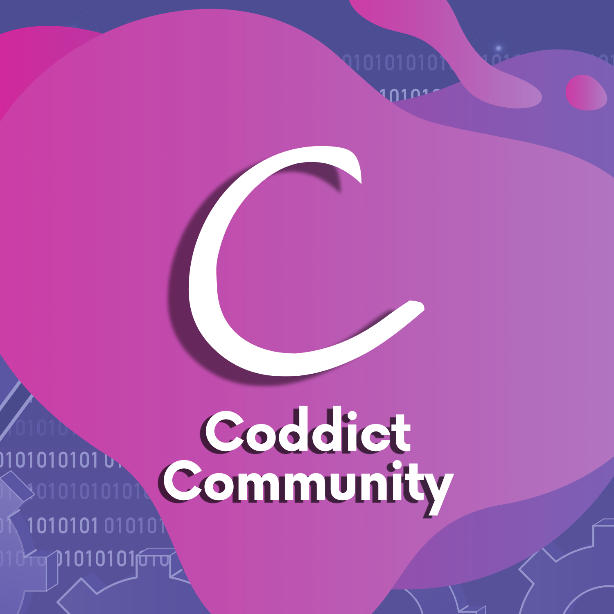

<h1 align="center">Coddict Branding Assets</h1>

#### Community brand assets for the Coddict community

## About Coddict

All coding related problems' solutions, career guidance, advices and tutorials in one place. Coddict offers you free mentorship for all things computer science and programming.

## Assets in the Repository

| Resource |    Type   |  Dimension  | Preview |
| :------: | :-------: | :---------: | :-----: |
| Banner   | PNG       | 2000 x 600  |  |
| Banner   | PNG       | 4000 x 1200 |  |
| Banner   | PNG       | 6000 x 1800 |  |
| Banner (LinkedIn) | PNG       | 3384 x 573 |  |
| Logo   | PNG       | 1000 x 1000 |  |
| Logo   | PNG       | 1500 x 1500 |  |
| Logo   | PNG       | 500 x 500 |  |

## License
---
[MIT License](LICENSE)    Copyright (c) 2021 Coddict Community
